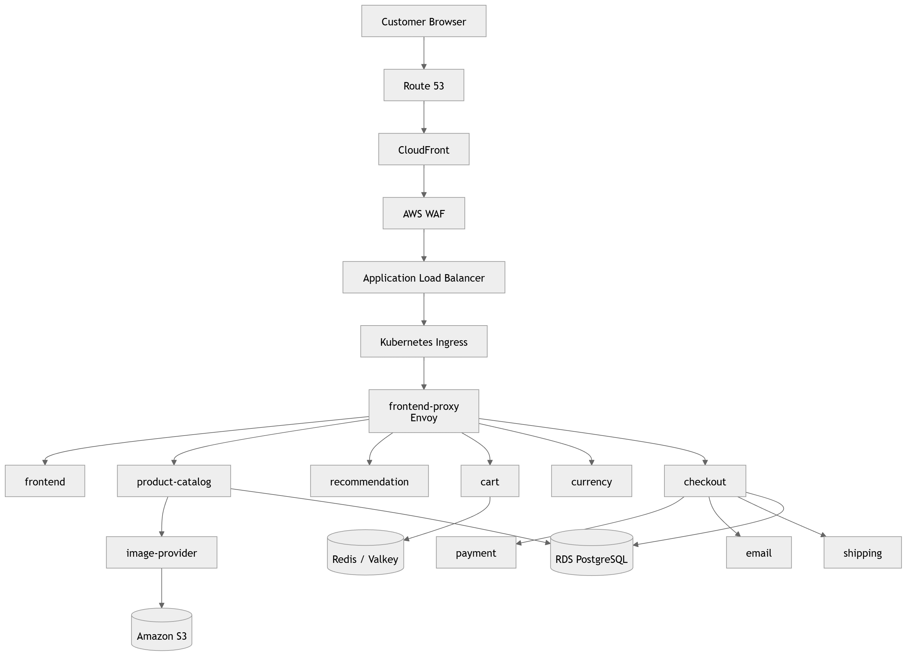

# 01 — Project Overview

## What Is Astronomy Shop?

Astronomy Shop is a cloud-native, distributed e-commerce platform built on AWS and Amazon EKS. It is designed around microservices so that customer-facing functions can be delivered, operated, scaled, and observed through a shared platform rather than through manual server administration.

## Why Was It Built?

The project models a retail system that must support a complete online customer journey while giving engineers a repeatable way to provision infrastructure, release services, control runtime access, and validate platform health.

The engineering objective is not simply to deploy containers. It is to provide an automated, secure, scalable application delivery platform that engineers can reliably operate.

## Customer Journey

Browse products
→ Product Catalog returns product data
→ Image Provider returns product images
→ Recommendation suggests related products
→ Cart stores selected items
→ Checkout coordinates order processing
→ Payment processes payment activity
→ Email and Shipping handle follow-up workflow

## Platform Promise

The platform is designed to provide:

- Automated infrastructure provisioning through Terraform.
- Automated application delivery through CI, ECR, GitOps, and Argo CD.
- Secure runtime configuration through AWS Secrets Manager, External Secrets, OIDC, and IRSA.
- Kubernetes-based workload management through EKS, Helm, Argo Rollouts, HPA, and Karpenter.
- Managed data dependencies through RDS PostgreSQL, Redis/Valkey, and S3.
- Public HTTPS delivery through Route 53, CloudFront, WAF, ALB, Ingress, and Envoy.
- Baseline operational visibility through Prometheus, Grafana, metrics-server, and kube-state-metrics.

## Runtime Architecture and Customer Request Flow

## Delivery Flow

flowchart TD
Developer[Developer change] --> CI[GitHub Actions]
CI --> Build[Build container image]
Build --> Scan[Configured security scan]
Scan --> ECR[Private Amazon ECR]
ECR --> Digest[Resolve immutable SHA256 digest]
Digest --> GitOps[Commit Dev image reference to GitOps]
GitOps --> Argo[Argo CD detects desired state]
Argo --> Helm[Helm renders service manifests]
Helm --> Rollout[Argo Rollout updates workload]
Rollout --> Pod[Healthy Kubernetes Pod]

## How It Is Operated

Terraform controls AWS and platform configuration
GitOps controls desired Kubernetes application state
Argo CD reconciles Git into EKS
Argo Rollouts controls application release state
HPA scales service replicas
Karpenter provisions additional application nodes when needed
Prometheus and Grafana provide baseline platform health visibility
AWS Budget constrains Dev spend

## Evidence and Result

Dev evidence verifies the public HTTPS application, eleven healthy services, GitOps reconciliation, Argo Rollout availability, HPA, Karpenter NodeClaims, Prometheus/Grafana, Terraform no-drift status, and the Dev AWS Budget.

✅ Astronomy Shop is a verified Dev cloud-native platform, not a collection of disconnected tool demonstrations.

## Current Scope Boundary

Dev proves integration and operational foundations. It does not claim production-level SLA, persistent logs/traces, production approval gates, or production-scale resilience testing.
