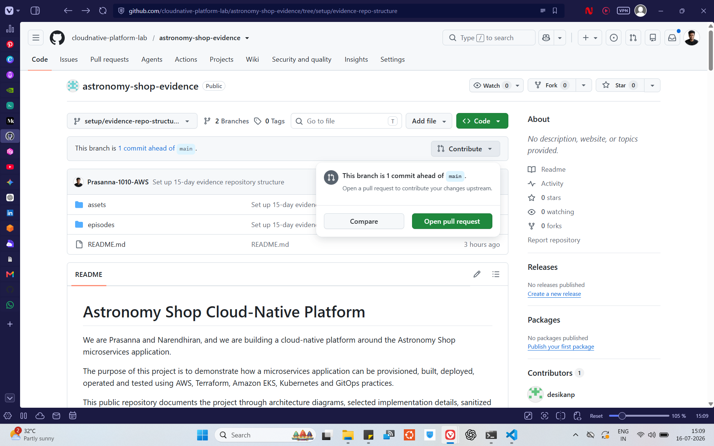
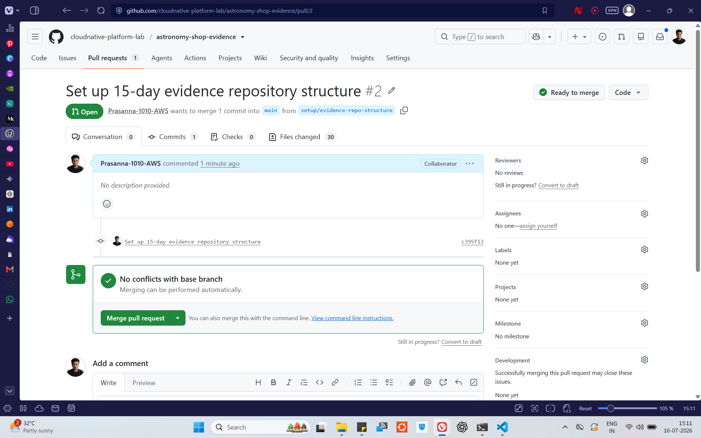
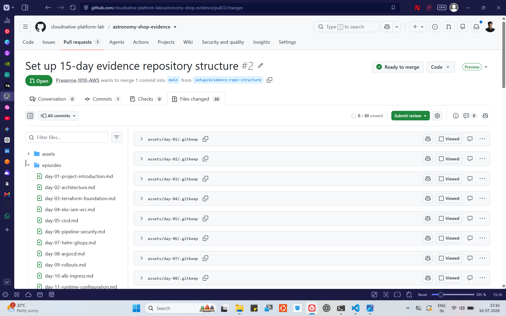
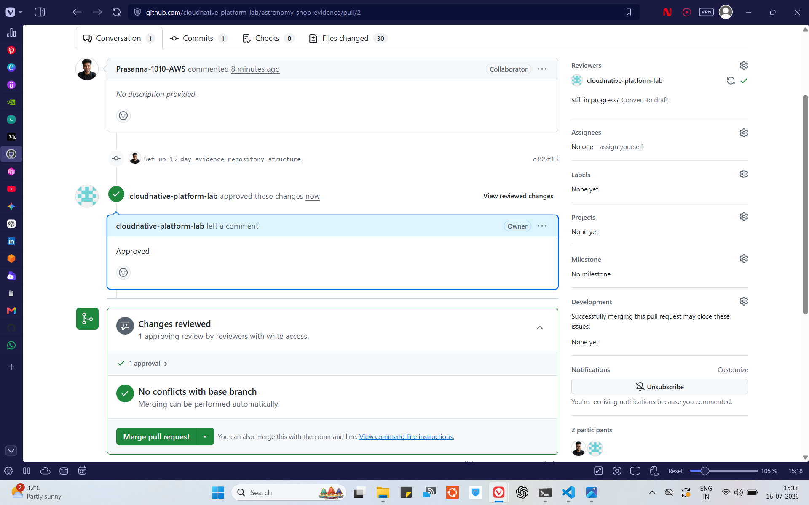
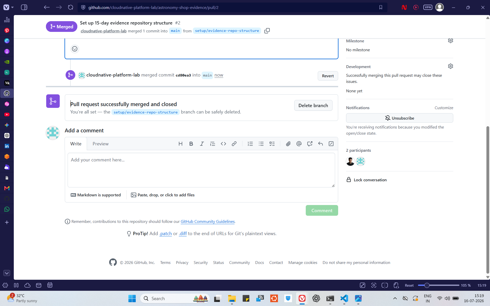
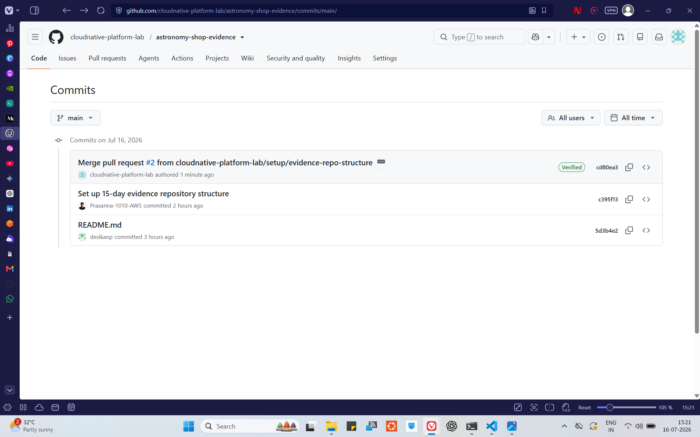

## Repository Collaboration Workflow

The repository is owned by the `cloudnative-platform-lab` account.

The initial repository structure was created on a separate feature branch and submitted by the `Prasanna-1010-AWS` account through a pull request.

The repository owner reviewed the changed files, approved the pull request and merged the changes into the protected `main` branch.

### Evidence

#### Feature branch created

#### Pull request opened

#### Files reviewed

#### Pull request approved

#### Pull request merged

#### Main branch history

### What this proves

- Changes were developed on a separate branch.
- The contributor did not push the repository structure directly to `main`.
- The proposed changes were visible through a pull request.
- The changed files were reviewed before merging.
- The repository owner approved the contribution.
- The approved changes were merged into the main branch.